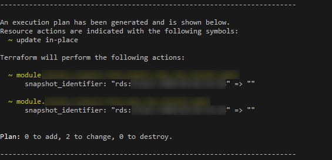

## 스냅샷에서 RDS 복원

RDS는 스냅샷에서 복원하기 위해서는 항상 새로운 인스턴스를 띄워야 한다.

그리고 거기에 주의점이 있는데, 복원 인스턴스를 띄우면 DB parameter group과 security group이 default가 지정되어 버린다고 한다. 그래서 재 
지정이 필요하다.

> When you restore a DB instance, the default DB parameter group is associated with the restored instance. As soon as the restore is complete and your new DB instance is available, you must associate any custom DB parameter group used by the instance you restored from.

> When you restore a DB instance, the default security group is associated with the restored instance. As soon as the restore is complete and your new DB instance is available, you must associate any custom security groups used by the instance you restored from.

https://docs.aws.amazon.com/AmazonRDS/latest/UserGuide/USER_RestoreFromSnapshot.html

그리고 스냅샷을 남겼던 인스턴스와 다른 타입의 인스턴스에 복원할 수 있는데, 이 경우에는 변환(?) 과정이 있어서 시간이 걸린다고 한다.

> You can restore a DB instance and use a different storage type than the source DB snapshot. In this case, the restoration process is slower because of the additional work required to migrate the data to the new storage type.

Terraform에서는 `aws_rds_instance`에 `snapshot_identifier`라는 Optional variable이 있고, 여기에 snapshot 이름을 지정하면 인스턴스를 만들 때, 복원을 한다고 한다.

그럼 다음 궁금증이 생긴다.

Q. parameter group과 security group이 default로 지정된다는데, terraform은 알아서 잘 다시 설정 해 주나?

그런 것 같다. terraform을 통해 생성된 cluster와 instance를 살펴보니, 전부 제대로 지정되어 있다.

Q. 인스턴스 생성 이후에 `snapshot_identifier` 값을 삭제하면 어떻게 되나?

변경점으로 잡히지만, apply 해 보면 되게 빨리 applying이 완료 되고 변화도 없어 보인다.
