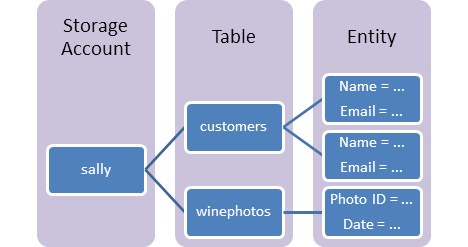

# Azure Table

A NoSQL datastore

## Table storage concepts

- **Table**: A table is a collection of entities. Tables don't enforce a schema on entities, which means a single table can contain entities that have different sets of properties.
- **Entity**: An entity is a set of properties, similar to a database row. An entity in Azure Storage can be up to 1MB in size. An entity in Azure Cosmos DB can be up to 2MB in size.
- **Properties**: A property is a name-value pair. Each entity can include up to 252 properties to store data. Each entity also has three system properties that specify a partition key, a row key, and a timestamp. Entities with the same partition key can be queried more quickly, and inserted/updated in atomic operations. An entity's row key is its unique identifier within a partition.

## Property

### Limitations

An entity can have up to 255 properties, including 3 system properties described in the following section. Therefore, the user may include up to 252 custom properties, in addition to the 3 system properties. The combined size of all data in an entity's properties cannot exceed 1 MB.

### System Properties

An entity always has the following system properties:

- `PartitionKey` property
- `RowKey` property
- `Timestamp` property

These system properties are automatically included for every entity in a table. The names of these properties are reserved and cannot be changed. The developer is responsible for inserting and updating the values of `PartitionKey` and `RowKey`. The server manages the value of `Timestamp`, which cannot be modified.

### PartitionKey Property

Tables are partitioned to support load balancing across storage nodes. A table's entities are organized by partition. A partition is a consecutive range of entities possessing the same partition key value. The partition key is a unique identifier for the partition within a given table, specified by the `PartitionKey` property. The partition key forms the first part of an entity's primary key. The partition key may be a string value up to 1 KB in size.

You must include the `PartitionKey` property in every insert, update, and delete operation.

### RowKey Property

The second part of the primary key is the row key, specified by the `RowKey` property. The row key is a unique identifier for an entity within a given partition. Together the `PartitionKey` and RowKey uniquely identify every entity within a table.

The row key is a string value that may be up to 1 KB in size.

You must include the `RowKey` property in every insert, update, and delete operation.

### Timestamp Property

The `Timestamp` property is a `DateTime` value that is maintained on the server side to record the time an entity was last modified. The Table service uses the `Timestamp` property internally to provide optimistic concurrency. The value of Timestamp is a monotonically increasing value, meaning that each time the entity is modified, the value of `Timestamp` increases for that entity. This property should not be set on insert or update operations (the value will be ignored).

## Performing Entity Group Transactions

The Table service supports batch transactions on entities that are in the same table and belong to the same partition group. Multiple Insert Entity, Update Entity, Merge Entity, Delete Entity, Insert Or Replace Entity, and Insert Or Merge Entity operations are supported within a single transaction.

### Requirements for Entity Group Transactions

An entity group transaction must meet the following requirements:

- All entities subject to operations as part of the transaction must have the same `PartitionKey` value.
- An entity can appear only once in the transaction, and only one operation may be performed against it.
- The transaction can include at most 100 entities, and its total payload may be no more than 4 MB in size.
- All entities are subject to the limitations described in [Understanding the Table Service Data Model](https://docs.microsoft.com/en-us/rest/api/storageservices/Understanding-the-Table-Service-Data-Model).

## References

- https://docs.microsoft.com/en-us/azure/storage/tables/table-storage-overview
- https://docs.microsoft.com/en-us/rest/api/storageservices/Understanding-the-Table-Service-Data-Model
- https://docs.microsoft.com/en-us/rest/api/storageservices/performing-entity-group-transactions