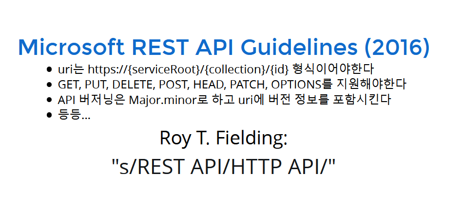

# RESTful API

## What is REST?

**REST**: **Re**presentational **s**tate **t**ransfer.

Six guiding constraints define a RESTful system:

- Client-server Architecture
- Statelessness
- Cacheability
- Layered System
- Code on demand (optional)
- Uniform interface
  - Resource identification in requests
  - Resource manipulation through representations
  - Self-descriptive messages
  - Hypermedia as the engine of application state (HATEOAS)

### reference

- https://en.wikipedia.org/wiki/Representational_state_transfer

## There is no REST API



image from http://slides.com/eungjun/rest

- [Microsoft REST API Guidelines](https://github.com/Microsoft/api-guidelines)

> REST doesn’t describe APIs. REST describes the architectural characteristics of an entire system, which includes all of the different components of that system.
> 
> from: https://www.howarddierking.com/2016/09/15/there-is-no-rest-api/

----

## PUT vs. PATCH (in HTTP API)

### TL;DR

**PUT** is used to replace the entire entity.
**PATCH** is used to patch the entity.

----

When using PUT, it is assumed that you are sending the complete entity, and that complete entity *replaces* any existing entity at that URI.

```
{ "username": "skwee357", "email": "skwee357@domain.com" }
```

If you POST this document to /users, as you suggest, then you might get back an entity such as

```
## /users/1
{
    "username": "skwee357",
    "email": "skwee357@domain.com"
}
```

If you want to modify this entity later, you choose between PUT and PATCH. A PUT might look like this:

```
PUT /users/1
{
    "username": "skwee357",
    "email": "skwee357@gmail.com"       // new email address
}
```

You can accomplish the same using PATCH. That might look like this:

```
PATCH /users/1
{
    "email": "skwee357@gmail.com"       // new email address
}
```

### Using PUT wrong

```
GET /users/1
{
    "username": "skwee357",
    "email": "skwee357@domain.com"
}
PUT /users/1
{
    "email": "skwee357@gmail.com"       // new email address
}

GET /users/1
{
    "email": "skwee357@gmail.com"      // new email address... and nothing else!
}
```

reference: https://stackoverflow.com/a/34400076