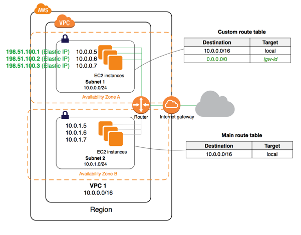

# VPC

Amazon Virtual Private Cloud(Amazon VPC)

http://docs.aws.amazon.com/ko_kr/AmazonVPC/latest/UserGuide/VPC_Introduction.html

> *Virtual Private Cloud(VPC)* 는 사용자의 AWS 계정 전용 가상 네트워크입니다. VPC는 AWS 클라우드에서 다른 가상 네트워크와 논리적으로 분리되어 있습니다. Amazon EC2 인스턴스와 같은 AWS 리소스를 VPC에서 실행할 수 있습니다. VPC를 구성할 수 있으며 그 IP 주소 범위를 선택하고 서브넷을 생성하고 라우팅 테이블, 네트워크 게이트웨이 및 보안 설정을 구성할 수 있습니다.

## Subnet

http://docs.aws.amazon.com/AmazonVPC/latest/UserGuide/VPC_Subnets.html

> When you create a VPC, you must specify a range of IPv4 addresses for the VPC in the form of a Classless Inter-Domain Routing (CIDR) block; for example, 10.0.0.0/16. This is the primary CIDR block for your VPC. For more information about CIDR notation, see [RFC 4632](https://tools.ietf.org/html/rfc4632).

### Public subnet

> If a subnet's traffic is routed to an internet gateway, the subnet is known as a public subnet.

> If you want your instance in a public subnet to communicate with the internet over IPv4, it must have a public IPv4 address or an Elastic IP address (IPv4).

### Private subnet

> If a subnet doesn't have a route to the internet gateway, the subnet is known as a private subnet.

Q. Internet access?

> You can connect an instance in a private subnet to the internet through the NAT device, which routes traffic from the instance to the internet gateway, and routes any responses to the instance.

### Subnet Routing

> Each subnet must be associated with a route table, which specifies the allowed routes for outbound traffic leaving the subnet. 

## Connection between two VPCs

VPC Peering connection

http://docs.aws.amazon.com/AmazonVPC/latest/PeeringGuide/Welcome.html

> A VPC peering connection is a networking connection between two VPCs that enables you to route traffic between them using private IPv4 addresses or IPv6 addresses. Instances in either VPC can communicate with each other as if they are within the same network. **You can create a VPC peering connection between your own VPCs, or with a VPC in another AWS account.** The VPCs can be in different regions (also known as an inter-region VPC peering connection).

> AWS uses the existing infrastructure of a VPC to create a VPC peering connection; it is neither a gateway nor a VPN connection, and does not rely on a separate piece of physical hardware. **There is no single point of failure** for communication or a bandwidth bottleneck. 

